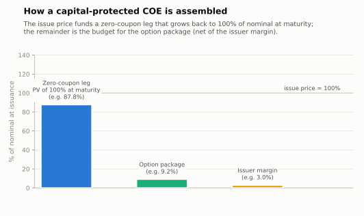
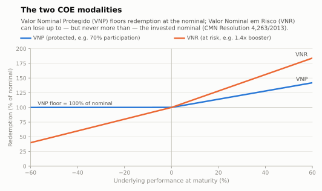

# Brazilian Structured Note — COE (Certificado de Operações Estruturadas)

How a **COE** — the *Certificado de Operações Estruturadas*, the Brazilian equivalent of an
international **structured note** — is designed, assembled, registered and paid out, and a
platform for booking one.

The documentation covers the product's legal and clearing framework, every standard payoff
structure traded in the Brazilian market with its formula, parameters, worked examples and
payoff diagrams, and the calculation conventions (CDI accrual, business-day count, performance
observation) used to settle it.

The platform — a .NET 10 back end (ADO.NET over SQL Server) and a React front end — turns that
into a booking screen: B3 payoff figures are described as **domain files**, a worker compiles
each one into a versioned JSON template stored in MSSQL, and both the API and the dynamic form
are generic readers of that template. Supporting a new figure is adding a file, not shipping a
release. Structured logs, traces and metrics come out of the box. See
[docs/platform.md](docs/platform.md).

> **Disclaimer:** this repository is technical documentation, not investment advice or an
> offer of securities. Always refer to the issuer's DIE (*Documento de Informações
> Essenciais*) and the official B3 / CVM / CMN sources listed in
> [docs/references.md](docs/references.md).

## What is a COE?

The COE is a certificate issued by banks that bundles, in a single registered instrument,
the rights and obligations of a fixed-income funding leg and a package of derivatives on
one or more underlying assets (equity indices, stocks, FX, interest rates, inflation,
commodities, or baskets — local or offshore). It was created by
[Law 12,249/2010](https://www.planalto.gov.br/ccivil_03/_ato2007-2010/2010/lei/l12249.htm)
and regulated by
[CMN Resolution 4,263/2013](https://www.bcb.gov.br/pre/normativos/busca/downloadNormativo.asp?arquivo=/Lists/Normativos/Attachments/48967/Res_4263_v1_O.pdf),
with public distribution governed by
[CVM Resolution 8/2020](https://conteudo.cvm.gov.br/legislacao/resolucoes/resol008.html)
(which replaced CVM Instruction 569/2015). Certificates are issued exclusively in
book-entry (escritural) form and registered at **B3**, the Brazilian exchange and clearing
house, which also publishes the operational manual and the formula handbook the product
follows.

Key design facts:

- **Issuers:** only multiple, commercial, investment and savings banks (and the Caixa
  Econômica Federal) may issue COEs.
- **Two modalities** (CMN Resolution 4,263/2013, art. 5):
  - **Valor Nominal Protegido (VNP)** — redemption at maturity is floored at the invested
    nominal value (principal protected, *by the issuer* — see credit risk below);
  - **Valor Nominal em Risco (VNR)** — the investor can lose up to, but never more than,
    the invested nominal (no leverage beyond the initial investment, no margin calls).
- **Single instrument:** one registration, one settlement, one tax event — instead of the
  investor holding a bond plus a strip of OTC options.
- **Credit risk, not covered by the FGC:** a COE is an unsecured obligation of the issuing
  bank and is **not** covered by the FGC (*Fundo Garantidor de Créditos*). "Capital
  protected" means protected against market risk only, conditional on issuer solvency.
- **Documentation:** every public distribution requires a **DIE** (*Documento de
  Informações Essenciais*) describing payoff, scenarios, dates, costs and risks.

### How the product is assembled

A capital-protected COE is economically a **zero-coupon funding leg + an option package**:
the issue price buys a discount bond that accretes back to 100% of nominal at maturity,
and the present-value discount (plus the coupons the investor gives up) is the premium
budget used to buy the derivative package that produces the payoff — net of the issuer's
margin.



The two modalities compare as follows (full details in
[docs/overview.md](docs/overview.md)):



## Payoff catalog

All current standard payoff structures ("figuras de payoff"), each documented with
formula, parameters, worked example, scenario table and drawing:

| Payoff | Modality | View on the underlying | Doc |
|---|---|---|---|
| Call with participation | VNP | Bullish, uncapped | [docs/payoffs/call-participation.md](docs/payoffs/call-participation.md) |
| Call spread (capped call) | VNP | Moderately bullish | [docs/payoffs/call-spread.md](docs/payoffs/call-spread.md) |
| Put spread | VNP | Moderately bearish | [docs/payoffs/put-spread.md](docs/payoffs/put-spread.md) |
| Digital / dual indexer (duplo indexador) | VNP | Directional, all-or-nothing coupon | [docs/payoffs/digital-duplo-indexador.md](docs/payoffs/digital-duplo-indexador.md) |
| Shark fin (up-and-out call + rebate) | VNP | Bullish up to a barrier | [docs/payoffs/shark-fin.md](docs/payoffs/shark-fin.md) |
| Range accrual | VNP | Sideways / range-bound | [docs/payoffs/range-accrual.md](docs/payoffs/range-accrual.md) |
| Autocall Athena | VNP or VNR | Mildly bullish, early redemption | [docs/payoffs/autocall-athena.md](docs/payoffs/autocall-athena.md) |
| Autocall Phoenix (memory coupons) | VNR | Sideways-to-bullish, income | [docs/payoffs/autocall-phoenix.md](docs/payoffs/autocall-phoenix.md) |
| Booster (leveraged upside) | VNR | Bullish with leverage | [docs/payoffs/booster.md](docs/payoffs/booster.md) |
| Reverse convertible | VNR | Sideways, income | [docs/payoffs/reverse-convertible.md](docs/payoffs/reverse-convertible.md) |
| Twin win | VNR | Volatile, direction-agnostic | [docs/payoffs/twin-win.md](docs/payoffs/twin-win.md) |

## Repository map

```
README.md                     ← you are here: product design overview
docs/
  README.md                   ← documentation index
  overview.md                 ← full product design: legal framework, lifecycle, risks, tax
  parameters.md               ← every parameter: registration fields + payoff parameters
  calculations.md             ← calculation conventions: CDI/pre/IPCA accrual, DU/252,
                                performance observation, FX, valuation
  platform.md                 ← the booking platform: architecture, validation, endpoints
  glossary.md                 ← PT-BR ↔ EN glossary
  references.md               ← all normative, clearing and bibliographic references
  payoffs/                    ← one document per payoff structure (formulas + examples)
  figures/                    ← payoff drawings (SVG) + generate_figures.py (reproducible)
  clearing/                   ← B3 clearing documents (Manual de Operações, Caderno de
                                Fórmulas, Manual de Normas) — see its README

reference/b3/                 ← B3's published exports: figures, domains, fields, underlyings,
                                and the per-figure attribute annex of the Manual de Operações
domain/                       ← the figure catalog the platform runs on — see its README
  common/                     ← reusable blocks: identification, underlying, remuneration,
                                barriers, autocall, settlement
  figures/                    ← one file per B3 figure code, hand-written
    generated/                ← the rest of the catalogue, written by tools/Coe.DomainGen
src/
  Coe.Core/                   ← template model, expression AST + evaluator, validation engine
  Coe.Ingestion/              ← domain-file reader and template compiler
  Coe.Infrastructure/         ← ADO.NET data layer, template cache, booking, server-side checks
  Coe.Observability/          ← Serilog + OpenTelemetry wiring shared by both hosts
  Coe.Api/                    ← minimal API: templates, assets, validation
  Coe.Worker/                 ← ingestion worker (file watch + interval)
web/                          ← React + TypeScript: asset list, figure picker, dynamic form
tools/b3-annex/               ← extracts the figure-attribute annex out of B3's manual (PDF → CSV)
tools/Coe.DomainGen/          ← turns that annex into a domain file per catalogue figure
tests/Coe.Tests/              ← expression, compiler, validation and database suites
tests/Coe.Benchmarks/         ← BenchmarkDotNet harness for the validation path
db/                           ← re-runnable schema and reference-data scripts
deploy/                       ← OpenTelemetry collector config for local work
```

## The platform

**Asset list.** Filtered by a reference date: an asset is listed when it is live on that date,
i.e. `issueDate ≤ referenceDate ≤ maturityDate`. From there, create a new asset or edit one.

**Booking.** Pick a figure, then fill in a form built entirely from that figure's template — the
common registration attributes pinned at the top, and the payoff, basket, cash-flow and barrier
blocks as tabs, each appearing only when the figure and the values so far call for it.

**Validation as you type.** The template carries every rule, including the cross-field ones, in
a form both sides evaluate: the browser answers instantly, and a debounced call to
`POST /api/assets/validate` answers the checks that need reference data — business-day
calendars, code uniqueness. Findings land next to the attribute they are about. Errors block
the save; warnings do not, and the ones a user accepts are stored on the asset for audit.

**The API is the authority.** Whatever the browser checked, every save re-runs the full
validation server-side, re-derives computed attributes from their inputs, and only then writes.

**The whole catalogue is bookable.** B3 publishes 88 payoff figures and describes the attributes
of 84 of them in the field annex of the *Manual de Operações*. That annex is extracted to
[reference/b3/campos-figuras.csv](reference/b3/README.md) and compiled into a domain file per
figure, so every figure B3 documents has a real form — with the type, precision, domain and
conditions taken from B3's own instructions. Ten figures are additionally hand-written, with the
formula symbols and the economic warnings a desk would otherwise catch by eye; those always win.
The four figures whose annex B3 has withdrawn appear in the picker marked as having no form,
rather than silently missing.

**Checked against B3's own data.** The figure catalogue, registration domains, strategy-field
dictionary and underlying master are committed under [reference/b3/](reference/b3/README.md), and
the compiler validates every domain file against them — a figure code B3 does not publish, or an
option code it has retired, fails ingestion rather than a registration.

**Built to be watched and to stay quick.** Serilog writes structured logs stamped with the trace
and span they happened in; OpenTelemetry exports traces and metrics for validation, ingestion,
saves and every SQL command. A field-scope validation costs ~9 µs and a full one ~17 µs, while
parsing a template costs 336 µs — which is why template versions are cached for the life of the
process and the browser fetches each one once behind an ETag. Numbers and the reasoning are in
[docs/platform.md](docs/platform.md#performance).

```bash
docker compose up -d mssql                # SQL Server
dotnet run --project src/Coe.Worker       # compile domain/ into templates, keep watching
dotnet run --project src/Coe.Api          # http://localhost:5080
cd web && npm install && npm run dev      # http://localhost:5173
```

Full architecture in [docs/platform.md](docs/platform.md); how to add or change a figure in
[domain/README.md](domain/README.md).

## References

The complete list, with links, lives in [docs/references.md](docs/references.md). The
primary sources are:

- **Law 12,249, of June 11, 2010** — creates the COE.
- **CMN Resolution 4,263, of September 5, 2013** — conditions of issuance; VNP/VNR
  modalities; eligible underlyings.
- **CVM Resolution 8/2020** (replacing CVM Instruction 569/2015) — public offering with
  automatic registration waiver; the DIE.
- **B3, [Manual de Operações — COE](https://www.b3.com.br/pt_br/regulacao/estrutura-normativa/estrutura-normativa/manuais-de-operacoes-8ae490ca69088bf00169104ff0ad7417/certificado-de-operacoes-estruturadas-coe/)** — registration fields and lifecycle events.
- **B3, [Caderno de Fórmulas — COE](https://www.b3.com.br/data/files/E2/D1/DC/38/839009105391B9F8AC094EA8/CADERNO%20DE%20FORMULAS%20-%20COE.pdf)** — calculation methodology for registered parameters.
- **ANBIMA — [COE regulatory summary](https://www.anbima.com.br/pt_br/informar/regulacao/informe-de-legislacao/certificados-de-operacoes-estruturadas-coe.htm)** and self-regulation code for distribution.
