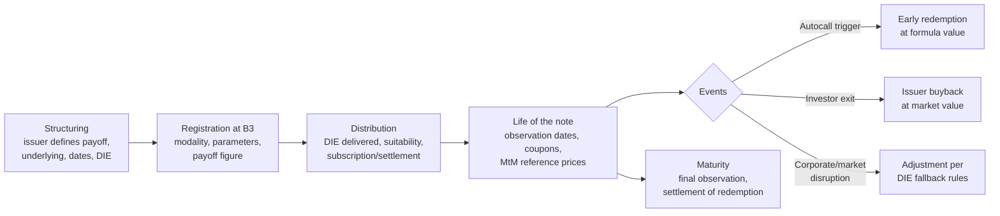

# COE product design — overview

The **Certificado de Operações Estruturadas (COE)** is the Brazilian legal wrapper for a
structured note: a single bank-issued, book-entry certificate that embeds a fixed-income
funding leg and a derivatives package on one or more underlyings. This document describes
the design end to end: legal framework, economic construction, modalities, lifecycle,
distribution and risks. Parameters are detailed in [parameters.md](parameters.md),
calculation conventions in [calculations.md](calculations.md), and each payoff in
[payoffs/](payoffs/README.md).

## 1. Legal and regulatory framework

| Norm | What it establishes |
|---|---|
| [Law 12,249/2010](https://www.planalto.gov.br/ccivil_03/_ato2007-2010/2010/lei/l12249.htm) | Creates the COE as a certificate issued against structured operations, representing a single and indivisible set of rights and obligations. Originated in Provisional Measure 472/2009. |
| [CMN Resolution 4,263/2013](https://www.bcb.gov.br/estabilidadefinanceira/exibenormativo?tipo=Resolu%C3%A7%C3%A3o&numero=4263) | Conditions of issuance: eligible issuers, exclusive book-entry form, mandatory registration, the two modalities (VNP / VNR), eligible reference assets, prohibition of losses beyond the invested nominal. Product live since January 6, 2014. |
| [CVM Instruction 569/2015](https://conteudo.cvm.gov.br/legislacao/instrucoes/inst569.html) *(revoked)* | First rule for public offers of COE with registration waiver; created the **DIE**. |
| [CVM Resolution 8/2020](https://conteudo.cvm.gov.br/legislacao/resolucoes/resol008.html) | Current rule for public distribution of COE with automatic registration waiver; DIE content and delivery duties; distributor obligations. |
| B3 rulebooks — [Manual de Normas / Manual de Operações COE](https://www.b3.com.br/pt_br/regulacao/estrutura-normativa/estrutura-normativa/manuais-de-operacoes-8ae490ca69088bf00169104ff0ad7417/certificado-de-operacoes-estruturadas-coe/) | Registration, custody, lifecycle events, settlement, and the [Caderno de Fórmulas](https://www.b3.com.br/data/files/E2/D1/DC/38/839009105391B9F8AC094EA8/CADERNO%20DE%20FORMULAS%20-%20COE.pdf) calculation methodology. See [clearing/](clearing/README.md). |
| [ANBIMA self-regulation](https://www.anbima.com.br/pt_br/informar/regulacao/informe-de-legislacao/certificados-de-operacoes-estruturadas-coe.htm) | Distribution rules (suitability, DIE standards, marketing material) under the ANBIMA code for distribution of investment products. |

**Who can issue:** multiple banks, commercial banks, investment banks and savings banks
(*caixas econômicas*). Registration of the certificate in an authorized registrar (B3) is
mandatory; there is no physical certificate.

## 2. Economic construction

A COE consolidates into one instrument what would otherwise be a portfolio of a bank bond
plus OTC derivatives:

- **Funding leg.** The investor's cash is bank funding. For a capital-protected note, the
  issuer sets aside the present value of the nominal — a zero-coupon leg discounted at the
  bank's funding rate (typically a spread over the DI curve) that accretes to 100% of the
  nominal at maturity.
- **Option package.** The difference between the issue price and that present value — the
  *premium budget* — buys the derivative package (calls, puts, digitals, barriers,
  autocall strips) that generates the variable payoff.
- **Issuer margin.** Part of the budget is retained as structuring margin; the DIE's
  scenario section and B3's reference data are the investor's window into the embedded
  economics.

The size of the premium budget explains most design choices: with the DI rate high, the
zero-coupon leg is cheap (e.g. ~87.8% for 3 years at ~4.4% per year of forward discount),
leaving a large budget — which is why Brazilian capital-protected notes can offer high
participations, and why structures with sold optionality (caps, knock-outs, digitals) are
used to enlarge the budget further.

## 3. Modalities

CMN Resolution 4,263/2013 admits exactly two modalities, which must be stated in the
registration and in the DIE:

| | Valor Nominal Protegido (VNP) | Valor Nominal em Risco (VNR) |
|---|---|---|
| Floor at maturity | 100% of the nominal value | 0 — total loss possible |
| Loss beyond invested capital | Never | Never (forbidden by the Resolution) |
| Margin calls / leverage beyond nominal | No | No |
| Typical structures | Participation calls/puts, digitals, shark fin, range accrual | Boosters, autocalls with barrier, reverse convertibles, twin win |
| Protection is | Market-risk protection by the **issuer** — still exposed to issuer credit | — |

The nominal protection in a VNP note applies **at maturity only**: an early exit at market
value (issuer buyback) can realize a loss even in a protected note.

## 4. Lifecycle

Lifecycle events registered and settled through B3:

1. **Registration / issuance** (*registro/emissão*) — issuer registers the certificate
   with all fields in [parameters.md](parameters.md); position is created against the
   investor's custody account.
2. **Observation dates** (*datas de observação/apuração*) — fixings of the underlying used
   by the payoff formula (initial, periodic, final; possibly averaging windows).
3. **Coupon payments** (*pagamento de rendimentos*) — for structures with interim coupons
   (Phoenix, range accrual paid periodically).
4. **Early redemption** (*resgate antecipado*) — automatic (autocall trigger) or by
   issuer/investor agreement at market value (*recompra/revenda*).
5. **Maturity** (*vencimento*) — final fixing, calculation of the redemption amount per
   the registered formula, cash settlement in BRL.

## 5. Distribution and the DIE

Public distribution is exempt from CVM offer registration provided the offer follows CVM
Resolution 8/2020, whose centerpiece is the **DIE — Documento de Informações Essenciais**:

- plain-language description of the payoff, with **scenario tables** (favorable, neutral,
  adverse) and the exact formula and parameters;
- all dates (issue, observation, payment, maturity) and conditions for early redemption;
- the warning that the COE is **not covered by the FGC**;
- costs, taxation, and the target investor;
- delivered to the investor **before** the investment decision; distributors follow
  suitability rules (CVM Resolution 30/2021) and the ANBIMA code.

## 6. Risks

| Risk | Notes |
|---|---|
| Issuer credit risk | The COE is an unsecured claim on the issuing bank; **no FGC coverage**. Both VNP and VNR carry it in full. |
| Market risk | VNR: up to 100% loss of nominal. VNP: opportunity cost — redemption at 100% of nominal with zero return can underperform CDI substantially. |
| Liquidity risk | No organized secondary market; exit before maturity depends on issuer buyback at market value (bid spread, protection does not apply). |
| Path/observation risk | Barriers and autocall triggers make the payoff depend on specific fixings; a single observation date can decide the outcome. |
| FX / quanto risk | Offshore underlyings may be quantoed into BRL (no FX exposure) or composite (FX exposure included) — the registered convention changes the risk materially. See [calculations.md](calculations.md). |
| Reinvestment risk | Autocalls tend to redeem early exactly when markets did well, forcing reinvestment at then-current conditions. |

## 7. Taxation (investor, individuals)

COE income is taxed as **fixed income** (Law 11,033/2004 regime): withholding income tax
on the positive difference between redemption/sale and acquisition value, at the
regressive schedule — 22.5% (≤ 180 days), 20% (181–360), 17.5% (361–720), 15% (> 720
days). IOF applies to redemptions within 30 days. There is no periodic *come-cotas*.
Losses in a COE are not compensable against gains in other instruments. (Always confirm
current rules with the issuer's DIE and a tax advisor.)

## 8. References

See [references.md](references.md) for the complete normative and bibliographic list.
