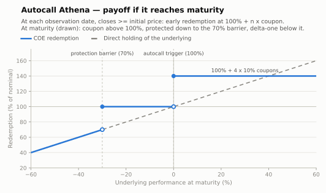

# Autocall Athena (capital protected or at risk)

The workhorse of the Brazilian COE market. On each scheduled **observation date**, if the
underlying closes at or above the **autocall trigger**, the note redeems early at the
nominal plus an accumulated coupon (one coupon per elapsed period — the "snowball"). If
it never triggers, the maturity payoff depends on the **protection barrier**.

- **Modality:** issued both as **VNP** (protected at maturity) and — the classic Athena —
  as **VNR** (below the barrier the investor takes the downside). The figure draws the
  VNR maturity payoff; the VNP variant replaces the downside leg with 100%.
- **Investor view:** mildly bullish / flat; happy to be called early
- **Also known as:** *autocallable, snowball*
- **B3 registered figure:** COE001064 *Call com Participação* — the figure whose Dados
  Específicos are a schedule: `Strike 1(%)` plus `Data de Observação 1`–`10` against
  `Participação Indexador 1`–`10`, one participation per observation date. It is what
  [`domain/figures/coe001064-call-participacao-autocall.json`](../../domain/README.md) books.
  The early redemption itself is an event, not an attribute: it is commanded through the
  *Indicação de Disparo de Trigger* function, and a figure registered with
  `Período de Pagamento = Ato` settles on the trigger date rather than at maturity. B3
  registers **no protection barrier** among this figure's attributes — the VNR barrier drawn
  below is a term of the certificate, not one of its Dados Específicos

## Parameters

| Parameter | Symbol | Illustrative value |
|---|---|---|
| Unit nominal value | VN | R$ 1,000.00 |
| Observation dates | t₁…t₄ | semi-annual, 4 observations over 2 years |
| Autocall trigger | T_i | 100% of S₀ on every date (step-down variants reduce it over time) |
| Coupon per period | C | 10% (accumulates: i-th call pays i × C) |
| Protection barrier (maturity only) | H | 70% of S₀, European |
| Tenor | T | 2 years (if never called) |

## Payoff formula

```
On observation date t_i (i = 1…n−1):
    If S(t_i) ≥ T_i·S₀:   early redemption = VN × (1 + i × C)     → note terminates

At maturity t_n (never called):
    If S_T ≥ T_n·S₀:      Redemption = VN × (1 + n × C)
    If H·S₀ ≤ S_T < S₀:   Redemption = VN × 1                      (protected zone)
    If S_T < H·S₀:        Redemption = VN × (1 + Perf)             (VNR; VNP pays VN × 1)
```

Convention drawn: trigger verifies at `≥`; the protection holds at exactly the barrier
(breach is `<`).



## Worked example and scenarios

VN = R$ 1,000, semi-annual, C = 10%, trigger 100%, barrier 70% (VNR):

| Scenario | Path | Redemption | Return |
|---|---|---|---|
| Called at 1st observation | S(t₁) ≥ S₀ | 1,000 × 1.10 = **R$ 1,100.00** in 6 months | +10.0% |
| Called at 3rd observation | below S₀ at t₁,t₂; above at t₃ | 1,000 × 1.30 = **R$ 1,300.00** in 18 months | +30.0% |
| Never called, ends at −20% | S_T = 80% of S₀ | **R$ 1,000.00** | 0% |
| Never called, ends at −40% | S_T = 60% of S₀ (barrier breached) | 1,000 × 0.60 = **R$ 600.00** | −40.0% |

## Building blocks

Strip of **autocall digitals** (each paying 1 + i×C conditional on first trigger at t_i)
+ ZCB conditional on survival + (VNR) a **short European down-and-in put** at the
barrier. Priced by Monte Carlo or PDE on the observation schedule; the sold put and the
early-termination probability finance the headline coupon. Key risks: reinvestment (calls
early in good markets) and the barrier cliff at maturity.

## References

- B3, *Manual de Operações — COE* — early redemption events ([../clearing/](../clearing/README.md)).
- Hull, *Options, Futures and Other Derivatives*, ch. 26 (barriers, binaries).
- Bouzoubaa & Osseiran, *Exotic Options and Hybrids*, ch. on autocallables.
- [../references.md](../references.md)
