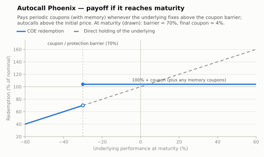

# Autocall Phoenix — memory coupons (capital at risk)

An income autocall: on each observation date the note pays a **periodic coupon** whenever
the underlying fixes at or above the **coupon barrier** — even if below the initial price
— and redeems early if it fixes at or above the **autocall trigger**. With **memory**,
coupons missed on earlier dates are recovered on the next date the condition verifies.

- **Modality:** VNR (below the protection barrier at maturity the investor takes the
  downside)
- **Investor view:** sideways-to-mildly-bullish; wants recurring income
- **Also known as:** *phoenix autocallable, autocall com cupom e memória*
- **B3 registration:** not a single figure — the coupon schedule is registered as
  **Fluxo de Caixa** (with its own `Remunerador no Fluxo`), and early redemption via the
  *Indicação de Disparo de Trigger* function

## Parameters

| Parameter | Symbol | Illustrative value |
|---|---|---|
| Unit nominal value | VN | R$ 1,000.00 |
| Observation dates | t₁…t₈ | quarterly over 2 years |
| Coupon per period | C | 4% |
| Coupon barrier | H_c | 70% of S₀ |
| Memory | — | yes |
| Autocall trigger | T_i | 100% of S₀ |
| Protection barrier (maturity, European) | H | 70% of S₀ |

## Payoff formula

```
On each observation date t_i:
    If S(t_i) ≥ H_c·S₀:   pay coupon = VN × C × (1 + missed)      (memory clears)
    If S(t_i) ≥ T_i·S₀:   early redemption at VN × 1 (+ the coupon above) → terminates

At maturity (never called):
    If S_T ≥ H·S₀:        Redemption = VN × 1  (+ final/memory coupons per the rule above)
    If S_T < H·S₀:        Redemption = VN × (1 + Perf)
```



## Worked example and scenarios

VN = R$ 1,000, quarterly C = 4%, barriers 70%, trigger 100%:

| Scenario | Path | Cash flows | Total return |
|---|---|---|---|
| Called at t₂ | S(t₁) = 95% (coupon, no call); S(t₂) = 102% | 40 + (1,000 + 40) at t₂ | +8.0% in 6 months |
| Memory at work | S(t₁) = 65% (no coupon); S(t₂) = 75% | 0 at t₁; 80 at t₂ (current + missed) | coupons preserved |
| Never called, S_T = 85% | coupons on dates ≥ 70% | …+ final 1,000 + 40 | positive carry |
| Never called, S_T = 55% | breach at maturity | final 1,000 × 0.55 = **R$ 550.00** | large loss, net of coupons received |

## Building blocks

Strip of **coupon digitals at H_c** (with the memory feature priced as
first-passage-style compound digitals) + autocall strip at T_i + **short European
down-and-in put at H**. Compared with [Athena](autocall-athena.md), the coupon flows even
without a rally — paid for by a lower effective coupon and the same barrier cliff.

## References

- B3, *Manual de Operações — COE* — coupon payment events ([../clearing/](../clearing/README.md)).
- Bouzoubaa & Osseiran, *Exotic Options and Hybrids* (Phoenix/memory features).
- Hull, *Options, Futures and Other Derivatives*, ch. 26.
- [../references.md](../references.md)
