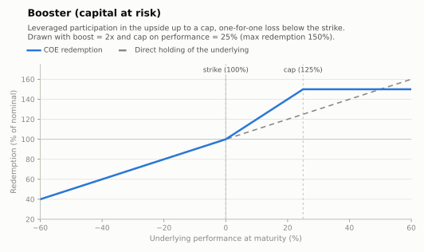

# Booster — leveraged upside (capital at risk)

Leverage without margin: the upside performance is multiplied by a **boost** factor
(typically 1.5×–3×), usually up to a cap, while the downside is taken one-for-one — never
beyond the invested nominal. The note monetizes protection the investor gives up: unlike
VNP structures, a fall hits the principal directly.

- **Modality:** VNR
- **Investor view:** decidedly bullish; accepts equity-like downside for levered upside
- **Also known as:** *alavancado, turbo, acelerador*
- **B3 registered figure:** the levered capped upside leg is COE001073
  *Call Alavancagens com Limitador* (two upside participations, vertex and limiter);
  the delta-one downside is carried by the package's sold-put leg (combined figures in
  the annex, e.g. COE001049 Call KO + Put)

## Parameters

| Parameter | Symbol | Illustrative value |
|---|---|---|
| Unit nominal value | VN | R$ 1,000.00 |
| Strike | K | 100% of S₀ |
| Boost | B | 2.0× |
| Cap on performance | Cap | 25% (⇒ max redemption 150%) |
| Downside participation | — | 100% (one-for-one) |
| Tenor | T | 2 years |

## Payoff formula

```
If Perf ≥ 0:   Redemption = VN × [ 1 + B × min(Perf, Cap) ]
If Perf < 0:   Redemption = VN × ( 1 + Perf )                  (floored at 0 by the modality)
```



## Worked example and scenarios

VN = R$ 1,000, B = 2×, Cap = 25%:

| Scenario | Perf | Redemption | Period return |
|---|---|---|---|
| Above the cap | +40% | 1,000 × (1 + 2×0.25) = **R$ 1,500.00** | +50.0% (max) |
| Moderate rally | +15% | 1,000 × (1 + 2×0.15) = **R$ 1,300.00** | +30.0% |
| Flat | 0% | **R$ 1,000.00** | 0% |
| Sell-off | −30% | **R$ 700.00** | −30.0% |

## Building blocks

`ZCB + B × call spread(K, K×(1+Cap)) − put(K)`: the short ATM put funds the extra calls.
Equivalently: delta-one below the strike, B× call spread above. A barrier variant
("bonus/booster com barreira") replaces the plain short put with a down-and-in put,
keeping the nominal whole for moderate falls — its maturity payoff then resembles the
[reverse convertible](reverse-convertible.md) downside.

## References

- B3, *Caderno de Fórmulas — COE* ([../clearing/](../clearing/README.md)).
- CMN Resolution 4,263/2013 (VNR: loss limited to the invested nominal).
- Hull, *Options, Futures and Other Derivatives*, ch. 12, 26.
- [../references.md](../references.md)
