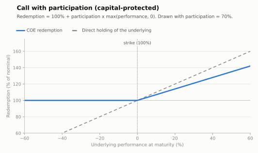

# Call with participation (capital protected)

The plainest bullish COE: the investor receives the nominal back plus a **participation**
in the positive performance of the underlying, uncapped. The classic first COE sold on
IBOVESPA, S&P 500 or offshore thematic indices.

- **Modality:** VNP (Valor Nominal Protegido)
- **Investor view:** bullish; wants upside without risking nominal
- **Also known as:** *capital protegido com participação na alta*
- **B3 registered figure:** COE001001 Call (also COE001064 *Call com Participação*)

## Parameters

| Parameter | Symbol | Illustrative value |
|---|---|---|
| Unit nominal value | VN | R$ 1,000.00 |
| Underlying / initial fixing | S₀ | IBOVESPA, closing on initial observation date |
| Strike | K | 100% of S₀ |
| Participation | Part | 70% |
| Tenor / final observation | T | 3 years (point-to-point or asian tail) |
| Base accrual in adverse scenario | — | none (100% of VN) |

## Payoff formula

```
Redemption = VN × [ 1 + Part × max(Perf, 0) ]         Perf = S_T/S₀ − 1
```



## Worked example and scenarios

VN = R$ 1,000, Part = 70%:

| Scenario | Perf | Redemption | Period return |
|---|---|---|---|
| Strong rally | +40% | 1,000 × (1 + 0.70×0.40) = **R$ 1,280.00** | +28.0% |
| Moderate rally | +15% | 1,000 × (1 + 0.70×0.15) = **R$ 1,105.00** | +10.5% |
| Flat | 0% | **R$ 1,000.00** | 0% |
| Sell-off | −30% | max(Perf,0)=0 → **R$ 1,000.00** | 0% (protection) |

The cost of protection is opportunity cost: R$ 1,000 at, say, 100% of CDI over the same 3
years might grow to ≈ R$ 1,400 — the DIE's scenario table must make this comparison
visible (CVM Resolution 8/2020).

## Building blocks

`zero-coupon leg (PV of 100%) + Part × ATM European call on S`. The participation is set
by the premium budget: `Part ≈ (1 − ZCB − margin) / call price`. High DI rates ⇒ cheap
ZCB ⇒ higher participation — see [../calculations.md](../calculations.md#6-worked-end-to-end-example-capital-protected-call).

## References

- B3, *Manual de Operações — COE* and *Caderno de Fórmulas — COE* ([../clearing/](../clearing/README.md)).
- CMN Resolution 4,263/2013 (VNP modality).
- Hull, *Options, Futures and Other Derivatives*, ch. 12 (European calls) and ch. 26.
- [../references.md](../references.md)
