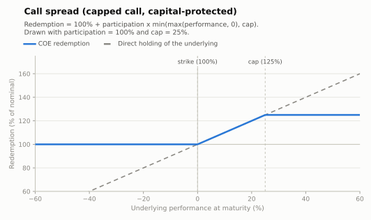

# Call spread — capped call (capital protected)

Bullish participation up to a **cap**: selling the upside beyond the cap enlarges the
premium budget, buying a higher participation (often 100%+) on the first leg of the rally.

- **Modality:** VNP
- **Investor view:** moderately bullish; accepts a ceiling on gains
- **Also known as:** *capital protegido com cap / trava de alta*
- **B3 registered figure:** COE001005 Call Spread

## Parameters

| Parameter | Symbol | Illustrative value |
|---|---|---|
| Unit nominal value | VN | R$ 1,000.00 |
| Strike | K | 100% of S₀ |
| Cap (max performance considered) | Cap | 25% |
| Participation | Part | 100% |
| Tenor | T | 2 years |

## Payoff formula

```
Redemption = VN × [ 1 + Part × min( max(Perf, 0), Cap ) ]
```

Maximum redemption: `VN × (1 + Part × Cap)` = 125% of VN in the drawn example.



## Worked example and scenarios

VN = R$ 1,000, Part = 100%, Cap = 25%:

| Scenario | Perf | Redemption | Period return |
|---|---|---|---|
| Above the cap | +40% | 1,000 × (1 + 0.25) = **R$ 1,250.00** | +25.0% (capped) |
| Inside the spread | +18% | **R$ 1,180.00** | +18.0% |
| Flat | 0% | **R$ 1,000.00** | 0% |
| Sell-off | −25% | **R$ 1,000.00** | 0% (protection) |

## Building blocks

`ZCB + Part × [ call(K) − call(K×(1+Cap)) ]` — a bull call spread. The short upper call
finances the higher participation; the structure is cheaper than the uncapped
[call with participation](call-participation.md), which is why it can offer Part = 100%.

## References

- B3, *Caderno de Fórmulas — COE* ([../clearing/](../clearing/README.md)).
- Hull, *Options, Futures and Other Derivatives*, ch. 12 (spreads).
- [../references.md](../references.md)
