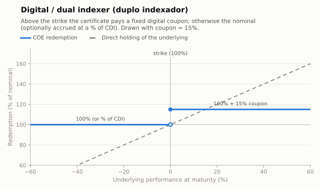

# Digital / dual indexer — duplo indexador (capital protected)

An all-or-nothing structure: if the digital condition verifies at the final observation,
the note pays a **fixed coupon**; otherwise the investor receives the nominal back —
in the classic Brazilian *duplo indexador* version, accrued at a percentage of CDI. The
name comes from the note switching between two "indexers" (a fixed rate vs a CDI
percentage) depending on the scenario.

- **Modality:** VNP
- **Investor view:** directional with a target level; wants a known, high coupon
- **Also known as:** *digital, binária, duplo indexador*

## Parameters

| Parameter | Symbol | Illustrative value |
|---|---|---|
| Unit nominal value | VN | R$ 1,000.00 |
| Digital strike | K | 100% of S₀ |
| Digital coupon | C | 15% (period) |
| Adverse-scenario accrual | p | 0% (plain) or e.g. 90% of CDI (duplo indexador) |
| Tenor | T | 18 months |
| Observation | — | European (final fixing only) in the drawn figure |

## Payoff formula

```
If S_T ≥ K:   Redemption = VN × (1 + C)
Else:         Redemption = VN × FatorDI(p)        (FatorDI per calculations.md; = 1 if p = 0)
```

Convention drawn: at `S_T = K` exactly, the coupon is paid (`≥`).



## Worked example and scenarios

VN = R$ 1,000, C = 15%, adverse leg at 90% of CDI, 18 months (378 DU), CDI flat at 15%
p.a. → `FatorDI(90) ≈ 1.2110` (see [../calculations.md](../calculations.md#21-di-cdi-factor-at-a-percentage-p)):

| Scenario | S_T vs K | Redemption | Period return |
|---|---|---|---|
| Rally, +1% or +40% alike | S_T ≥ K | 1,000 × 1.15 = **R$ 1,150.00** | +15.0% flat |
| Just below strike | S_T = 0.99×K | 1,000 × 1.2110 = **R$ 1,211.00** | +21.1% (90% CDI) |

Note the inversion typical of high-CDI environments: with CDI at 15% p.a., the "adverse"
CDI leg can outperform the digital coupon — the digital only makes sense when the coupon
exceeds the base accrual, or with p far below 100.

## Building blocks

`ZCB (optionally CDI-accruing) + cash-or-nothing call paying C`. Digitals are priced as
the limit of tight call spreads; discontinuity at K makes hedging near expiry ("pin
risk") the issuer's main cost. See Hull, ch. 26 (binary options).

## References

- B3, *Caderno de Fórmulas — COE* — DI factor precision ([../clearing/](../clearing/README.md)).
- Hull, *Options, Futures and Other Derivatives*, ch. 26.3 (binary options).
- [../references.md](../references.md)
