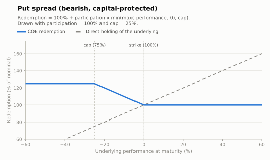

# Put spread — bearish participation (capital protected)

The mirror of the [call spread](call-spread.md): the investor gains when the underlying
**falls**, with participation on the drop down to a cap, and full nominal protection if
the market rises instead. Common on USDBRL (protection views) and on equity indices as a
tactical bearish note.

- **Modality:** VNP
- **Investor view:** moderately bearish / hedging a fall
- **Also known as:** *capital protegido com participação na baixa / trava de baixa*
- **B3 registered figure:** COE001006 Put Spread

## Parameters

| Parameter | Symbol | Illustrative value |
|---|---|---|
| Unit nominal value | VN | R$ 1,000.00 |
| Strike | K | 100% of S₀ |
| Cap (max drop considered) | Cap | 25% |
| Participation | Part | 100% |
| Tenor | T | 1 year |

## Payoff formula

```
Redemption = VN × [ 1 + Part × min( max(−Perf, 0), Cap ) ]
```

Maximum redemption: `VN × (1 + Part × Cap)` = 125% of VN in the drawn example, reached
when the underlying falls 25% or more.



## Worked example and scenarios

VN = R$ 1,000, Part = 100%, Cap = 25%:

| Scenario | Perf | Redemption | Period return |
|---|---|---|---|
| Crash | −40% | 1,000 × (1 + 0.25) = **R$ 1,250.00** | +25.0% (capped) |
| Moderate fall | −12% | **R$ 1,120.00** | +12.0% |
| Flat | 0% | **R$ 1,000.00** | 0% |
| Rally | +20% | **R$ 1,000.00** | 0% (protection) |

## Building blocks

`ZCB + Part × [ put(K) − put(K×(1−Cap)) ]` — a bear put spread on top of the funding leg.
An uncapped variant (plain put with participation) exists but is rarer: the sold lower
put materially cheapens the package.

## References

- B3, *Caderno de Fórmulas — COE* ([../clearing/](../clearing/README.md)).
- Hull, *Options, Futures and Other Derivatives*, ch. 12 (spreads).
- [../references.md](../references.md)
