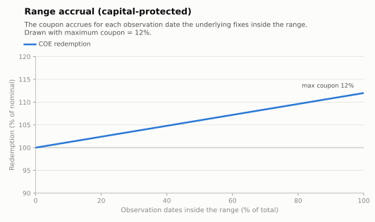

# Range accrual (capital protected)

An income structure for sideways markets: the coupon **accrues day by day** (or
observation by observation) while the underlying fixes **inside a range**. The final
coupon is the maximum coupon scaled by the fraction of observations spent in range.
Common on USDBRL and on the IBOVESPA.

- **Modality:** VNP
- **Investor view:** range-bound / low volatility
- **Also known as:** *fairway, corredor, acumulador de cupom*
- **B3 registered figure:** COE001015 Range Accrual (nested-range variant: COE001041
  Wedding Cake; one-sided accrual: COE001043 Edge Accrual)

## Parameters

| Parameter | Symbol | Illustrative value |
|---|---|---|
| Unit nominal value | VN | R$ 1,000.00 |
| Range | [L, U] | [90%, 115%] of S₀ |
| Maximum coupon | C_max | 12% (period) |
| Observation schedule | t₁…t_N | daily fixings, N total |
| Tenor | T | 1 year |

## Payoff formula

```
n_in       = #{ t_i : L·S₀ ≤ S(t_i) ≤ U·S₀ }
Redemption = VN × [ 1 + C_max × n_in / N ]
```

The natural x-axis of the drawing is the fraction of observations in range, not the final
performance — the payoff is **path-dependent** and linear in time-in-range:



## Worked example and scenarios

VN = R$ 1,000, C_max = 12%, N = 252 daily fixings:

| Scenario | Days in range | Redemption | Period return |
|---|---|---|---|
| Whole year inside | 252/252 | **R$ 1,120.00** | +12.0% |
| Breaks out after 9 months | 189/252 | 1,000 × (1 + 0.12×0.75) = **R$ 1,090.00** | +9.0% |
| Half the time | 126/252 | **R$ 1,060.00** | +6.0% |
| Breaks out immediately | 0/252 | **R$ 1,000.00** | 0% (protection) |

Variants: coupons paid periodically instead of at maturity; "wedding-cake" (two nested
ranges with two coupon levels); one-sided ranges (accrues while above/below a level).

## Building blocks

`ZCB + (C_max/N) × Σ_i double-no-touch digital(t_i, L, U)` — a strip of daily range
digitals. Short volatility by construction: realized volatility above the implied level
priced in erodes the coupon. See Hull, ch. 26 (binary options) and standard range-accrual
literature.

## References

- B3, *Caderno de Fórmulas — COE* ([../clearing/](../clearing/README.md)).
- Hull, *Options, Futures and Other Derivatives*, ch. 26.
- [../references.md](../references.md)
