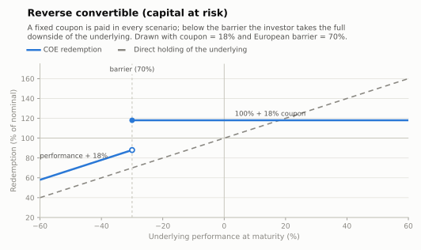

# Reverse convertible (capital at risk)

A yield structure on a single stock or index: the note pays a **fixed coupon in every
scenario**, and returns the nominal in full as long as the underlying does not finish
(or, in continuous variants, never trades) below the **barrier**. Below it, the investor
takes the full downside — as if converted into the stock at the initial price — plus the
coupon.

- **Modality:** VNR
- **Investor view:** neutral-to-mildly-bullish; sells downside insurance for income
- **Also known as:** *barrier reverse convertible; "renda extra" structures on single stocks*
- **B3 registered figure:** COE001022 *Put KI* — `Barreira KI (%)`, `Rebate KI(%)`,
  `Strike 1(%)` and `Participação cenário de baixa (%)`: the investor is short the knock-in
  put. The fixed coupon is registered beside the figure as Fluxo de Caixa

## Parameters

| Parameter | Symbol | Illustrative value |
|---|---|---|
| Unit nominal value | VN | R$ 1,000.00 |
| Underlying | S | single stock (e.g. PETR4) |
| Coupon (unconditional) | C | 18% (period; often paid periodically) |
| Barrier | H | 70% of S₀, European in the drawn figure |
| Tenor | T | 1 year |

## Payoff formula (European barrier)

```
If S_T ≥ H·S₀:   Redemption = VN × (1 + C)
If S_T < H·S₀:   Redemption = VN × (1 + Perf + C)
```

Convention drawn: protection holds at exactly the barrier (breach is `<`). Continuous or
discrete barrier monitoring (a true *down-and-in*) pays a higher coupon for materially
higher risk: a touch at any time activates the downside even if the stock recovers.



## Worked example and scenarios

VN = R$ 1,000, C = 18%, H = 70%:

| Scenario | Perf | Redemption | Period return |
|---|---|---|---|
| Rally +30% | ≥ barrier | **R$ 1,180.00** | +18.0% (coupon only — upside is sold) |
| Flat | ≥ barrier | **R$ 1,180.00** | +18.0% |
| Fall −25% | ≥ barrier | **R$ 1,180.00** | +18.0% (barrier held) |
| Crash −45% | < barrier | 1,000 × (1 − 0.45 + 0.18) = **R$ 730.00** | −27.0% |

## Building blocks

`ZCB + C (fixed coupon) − down-and-in put(K = S₀, H)`: the investor is short a knock-in
put; its premium is the coupon. Single-stock volatility and dividend risk drive pricing;
concentration on one name is the practical risk driver. See Hull, ch. 26.9.

## References

- B3, *Caderno de Fórmulas — COE* ([../clearing/](../clearing/README.md)).
- Hull, *Options, Futures and Other Derivatives*, ch. 26.9 (barrier options).
- Bouzoubaa & Osseiran, *Exotic Options and Hybrids* (reverse convertibles).
- [../references.md](../references.md)
