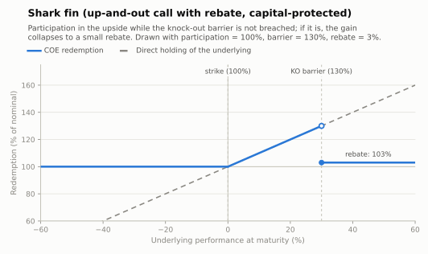

# Shark fin — up-and-out call with rebate (capital protected)

Full (often > 100%) participation in the rally **as long as** the underlying never
reaches the knock-out barrier; if the barrier is hit, the upside leg dies and the note
pays only a small **rebate**. The payoff drawing's silhouette gives the structure its
name.

- **Modality:** VNP
- **Investor view:** bullish but not *too* bullish — expects a rise that stays below the
  barrier
- **Also known as:** *call up-and-out com rebate, barreira de alta*

## Parameters

| Parameter | Symbol | Illustrative value |
|---|---|---|
| Unit nominal value | VN | R$ 1,000.00 |
| Strike | K | 100% of S₀ |
| Participation | Part | 100% |
| Knock-out barrier | H | 130% of S₀ |
| Rebate | R | 3% |
| Barrier observation | — | European in the drawn figure (continuous/discrete variants are common and cheaper) |
| Tenor | T | 2 years |

## Payoff formula (European barrier)

```
If S_T ≥ H:            Redemption = VN × (1 + R)
If K ≤ S_T < H:        Redemption = VN × (1 + Part × Perf)
If S_T < K:            Redemption = VN × 1
```

Convention drawn: touching the barrier exactly knocks out (`≥ H`). With **continuous**
observation the knock-out condition is "any trading day"; the note then loses the upside
even if the underlying later falls back below H — materially riskier for the investor and
cheaper for the issuer.



## Worked example and scenarios

VN = R$ 1,000, Part = 100%, H = 130%, R = 3%:

| Scenario | Outcome | Redemption | Period return |
|---|---|---|---|
| Rally to +29% | no KO | **R$ 1,290.00** | +29.0% (best case) |
| Rally to +35% | KO | 1,000 × 1.03 = **R$ 1,030.00** | +3.0% (rebate) |
| Mild rally +10% | no KO | **R$ 1,100.00** | +10.0% |
| Fall −20% | — | **R$ 1,000.00** | 0% (protection) |

The best and near-worst outcomes sit one tick apart at the barrier — the defining risk of
the structure, and why the DIE scenario table must show the knock-out case explicitly.

## Building blocks

`ZCB + Part × up-and-out call(K, H) + R × cash-or-nothing call at H`. The sold
"knock-out" (the call value surrendered above H) is what pays for participation ≥ 100%
under nominal protection. Barrier pricing: closed forms for continuous observation
(Merton/Reiner-Rubinstein), discrete-monitoring adjustment (Broadie–Glasserman–Kou) or
Monte Carlo — see Hull, ch. 26.

## References

- B3, *Caderno de Fórmulas — COE* ([../clearing/](../clearing/README.md)).
- Hull, *Options, Futures and Other Derivatives*, ch. 26.9 (barrier options).
- M. Broadie, P. Glasserman, S. Kou (1997), "A continuity correction for discrete barrier
  options", *Mathematical Finance* 7(4).
- [../references.md](../references.md)
