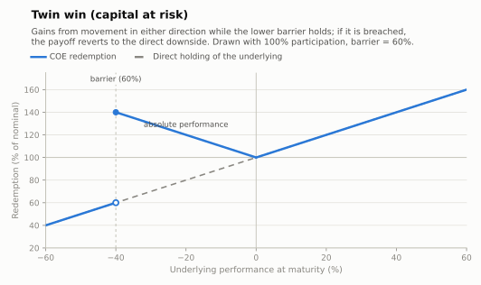

# Twin win (capital at risk)

A volatility play: the investor gains on the **absolute** movement of the underlying —
up or down — as long as the lower **barrier** is never breached. If it is, the downside
leg dies and the payoff reverts to the direct loss of the underlying.

- **Modality:** VNR
- **Investor view:** expects a large move but is agnostic on direction
- **Also known as:** *ganho duplo, straddle note*
- **B3 registered figure:** COE001009 Straddle Put KO (call + put with a knock-out
  barrier on the put leg, `Rebate no Cenário de Baixa` as % of the VFE)

## Parameters

| Parameter | Symbol | Illustrative value |
|---|---|---|
| Unit nominal value | VN | R$ 1,000.00 |
| Strike | K | 100% of S₀ |
| Participation (both directions) | Part | 100% (can differ per side) |
| Lower barrier | H | 60% of S₀, European in the drawn figure |
| Tenor | T | 2 years |

## Payoff formula (European barrier)

```
If Perf ≥ 0:                 Redemption = VN × (1 + Part_up × Perf)
If Perf < 0 and S_T ≥ H·S₀:  Redemption = VN × (1 + Part_down × |Perf|)
If S_T < H·S₀:               Redemption = VN × (1 + Perf)
```

Convention drawn: protection holds at exactly the barrier (breach is `<`). Continuous
monitoring variants knock the down-leg out on any touch during the life.



## Worked example and scenarios

VN = R$ 1,000, Part = 100% both sides, H = 60%:

| Scenario | Perf | Redemption | Period return |
|---|---|---|---|
| Rally | +35% | **R$ 1,350.00** | +35.0% |
| Fall inside barrier | −30% | 1,000 × (1 + 0.30) = **R$ 1,300.00** | +30.0% (loss turned into gain) |
| Flat | 0% | **R$ 1,000.00** | 0% (worst non-breach case) |
| Crash | −50% | barrier breached → **R$ 500.00** | −50.0% |

The worst outcomes are the two extremes of quietness and catastrophe: a flat market pays
nothing, and a breach converts the accumulated "win" on the downside into the full loss.

## Building blocks

`ZCB + Part_up × call(K) + Part_down × down-and-out put(K, H)`: the down-and-out put is
what pays on moderate falls and dies at the barrier. Long vega up to the barrier region;
the knock-out makes the note short volatility near H. See Hull, ch. 26.9.

## References

- B3, *Caderno de Fórmulas — COE* ([../clearing/](../clearing/README.md)).
- Hull, *Options, Futures and Other Derivatives*, ch. 26.9 (barrier options).
- Bouzoubaa & Osseiran, *Exotic Options and Hybrids* (twin-win structures).
- [../references.md](../references.md)
